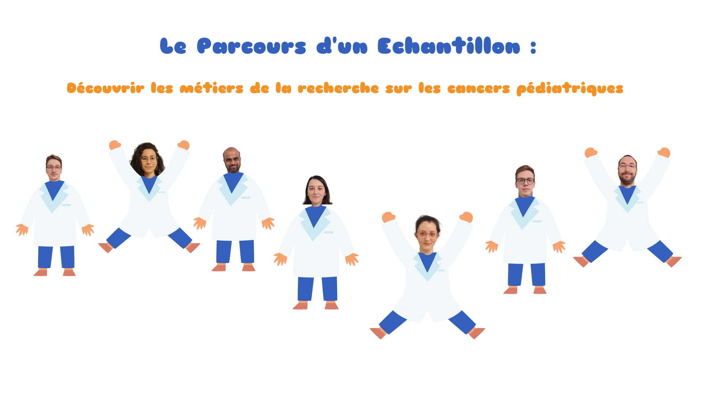

### Jeu de vulgarisation scientifique conçu pendant un livestream de 27h organisé par l'association 2500 voix le jeudi 15 février 2024. 
### Evénement de sensibilisation à l'occasion de la journée internationale des cancers de l'enfant.

Découvrez les différentes étapes de l'analyse d'un échantillon de biopsie d'un patient, depuis la culture cellulaire jusqu'au test de médicaments, avec ces mini-jeux ludiques et pédagogiques : 

- Introduction [**VOIR**](https://tdiot.github.io/main_scene/)
- Qu'est-ce que la culture cellulaire ? [**JOUER**](https://flavi23.github.io/jeu_culture_cellulaire/)
- Qu'est-ce que l'histologie ? [**MEMORY**](https://pmariebcd.github.io/2500voixMemory/) et [**PUZZLE**](https://pmariebcd.github.io/2500voixPuzzle/)
- Chromocapture ou l'extraction d'ADN [**JOUER**](https://ibmbalu.github.io/Chromocapture/)
- Qu'est-ce que le séquençage de l'ADN ? [**JOUER**](https://hermespara.github.io/snake_seq/)
- Drug discovery ou le test de médicaments [**JOUER**](https://tdiot.github.io/DrugDiscovery/)
